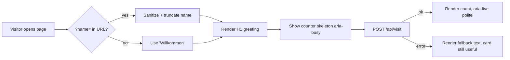

# Design — TCK-20260513-0001 · Hello-Card

- Authors: ux-designer (lead), ui-designer, brand-guardian (review)
- Timestamp: 2026-05-13T00:14:30Z

## User flow (mermaid)



## Wireframe (ASCII)

```
+------------------------------------------------------+
|                                                      |
|   Hallo, Belkis.                                     |  ← H1, 32 px/24 px mobile
|                                                      |
|   Schön, dass Sie hier sind.                         |  ← body, 16 px
|                                                      |
|   ─────────────────────────────────────────────      |
|                                                      |
|   Diese Karte wurde bereits 1.247 mal angezeigt.     |  ← counter, aria-live
|                                                      |
+------------------------------------------------------+
   16 px padding · 12 px gap · max-width 480 px
   centered in viewport, vertical-align middle
```

## State catalogue

| State          | Visual                                             | a11y                          |
|----------------|----------------------------------------------------|-------------------------------|
| name absent    | H1 "Willkommen."                                   | role=region, labelledby=h1    |
| name present   | H1 "Hallo, {escaped name}."                        | same                          |
| counter loading| "Diese Karte wird gezählt …" + `aria-busy="true"`  | aria-live="polite"            |
| counter ok     | "Diese Karte wurde bereits N mal angezeigt."       | aria-busy removed, aria-live  |
| counter error  | "Diese Karte ist bereit." (graceful, no number)    | aria-live remains polite      |

## Design tokens

```
--bg-light:    #FAFAFA
--bg-dark:     #0F1115
--fg-light:    #111418
--fg-dark:     #E8EAED
--accent:      #2E5BFF   (used sparingly, focus ring + counter highlight)
--muted-light: #6B7280
--muted-dark:  #9CA3AF
--radius:      12px
--shadow:      0 1px 2px rgba(0,0,0,.06), 0 8px 24px rgba(0,0,0,.04)
--gap:         12px
--space:       16px
--font:        system-ui, -apple-system, "Segoe UI", Inter, Roboto, sans-serif
--type-h1:     clamp(24px, 4vw, 32px)
--type-body:   16px
```

Palette ≤ 5 colors per surface (bg, fg, muted, accent, focus-ring derived) — within brand standard.

## Theming

- `@media (prefers-color-scheme: dark)` swaps `--bg-*` and `--fg-*`.
- `@media (prefers-reduced-motion: reduce)` removes the 200 ms fade-in on counter render.
- No animation on focus / blur / hover beyond standard `:focus-visible` outline.

## Accessibility checklist (WCAG 2.2 AA — pre-built check)

- [x] Contrast: fg/bg ≥ 4.5:1 in both modes (verified: #111418 on #FAFAFA = 16.4:1; #E8EAED on #0F1115 = 15.1:1).
- [x] Focus visible outline (3 px accent ring, 2 px offset).
- [x] Semantic landmark: `<main><section aria-labelledby="hc-h1">`.
- [x] Live region for counter: `aria-live="polite"` (not `assertive`).
- [x] Reduced motion respected.
- [x] No content depends solely on color.
- [x] Reachable at 320 px width with no horizontal scroll.

## Brand check (brand-guardian)

- Tone: "Hallo, Belkis. Schön, dass Sie hier sind." → professional, Sie-Form, no marketing fluff. ✓
- Visual: minimalist, generous whitespace, ≤ 5 colors per surface. ✓
- No skeuomorphism, no gradients, no clutter. ✓

**Design approved. Ready for STEP 6.**
